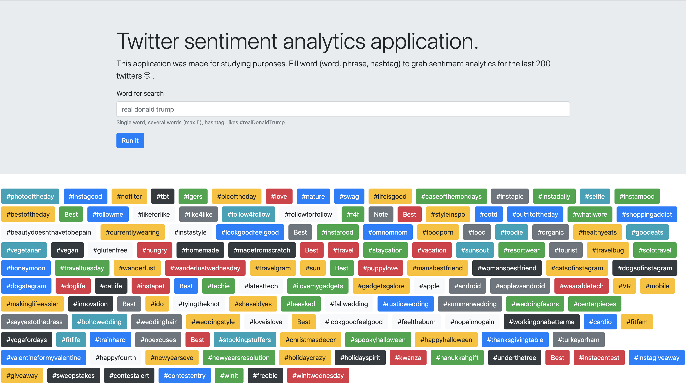
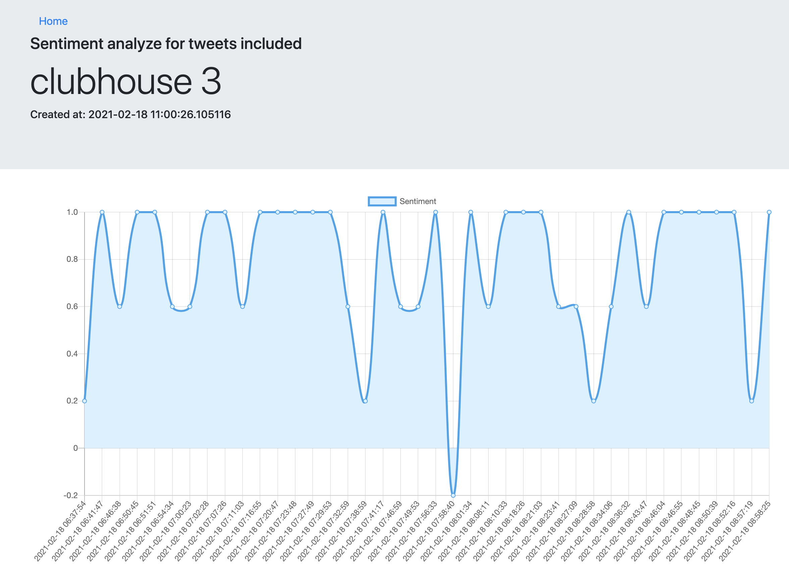

### Spark NLP Twitter sentiment analysis
#### Main page
 
 
 #### one job page
 
#### Batch approach.

###### GCP Storage architecture
```bash
gs://sentiment-twitter-analys
    |_models
      |_v1
        |_pipeline
        |_scores.txt
      |_v2
        |_pipeline
        |_scores.txt
    |_results
        |_job1
            |_meta.json
            |_twits.csv
            |_results.csv
        |_job2
            |_meta.json
            |_twits.csv
            |_results.csv

gs://sentiment-twitter-analys-scrap-job
    |_scrap_twits_jobs
      |_job1
        |_meta.json
      |_job2
        |_meta.json

gs://sentiment-twitter-analys-compute-job
    |_analytics_jobs
      |_job1
        |_meta.json
        |_twits.csv
      |_job2
        |_meta.json
        |_twits.csv
```

###### meta.json
```
{  
 "job_id": "some name",
 "quert": "some qurty phrase in twitter",
 "created_at": "some dat in ISO format",
}
```
###### twits.csv
```
tweet,created_at,likes_count,replies_count,retweets_count
@so thats my mans, 2021-02-02 09:17:35,10,0,0 
```
##### results.csv
```
2021-02-02 09:23:49, 4.0
2021-02-02 09:23:49, 0.0
2021-02-02 09:23:49, 4.0
2021-02-02 09:23:49, 0.0
2021-02-02 09:23:49, 4.0


```