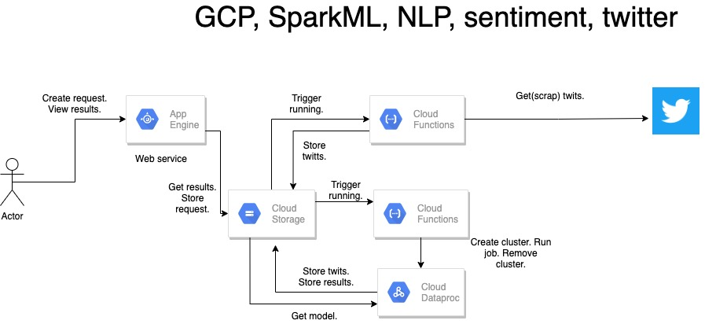

### Spark NLP Twitter sentiment analys 
#### Batch approach.

###### GCP Storage architecture
```bash
root
|_models
  |_v1
    |_pipeline
    |_scores.txt
  |_v2
    |_pipeline
    |_scores.txt
|_results
  |_query1
    |_meta.json
    |_twits.csv
    |_results.csv
  |_query2
    |_meta.json
    |_twits.csv
    |_results.csv
|_scrap_twits_jobs
  |_query1
    |_meta.json
  |_query2
    |_meta.json
|_analytics_jobs
  |_query1
    |_meta.json
    |_twits.csv
  |_query2
    |_meta.json
    |_twits.csv
```

###### meta.json
```
{  
 "name": "some name",
 "quert": "some qurty phrase in twitter",
 "created_at": "some dat in ISO format",
}
```
###### twits.csv
```
tweet,created_at,likes_count,replies_count,retweets_count
@so thats my mans, 2021-02-02 09:17:35,10,0,0 
```
##### results.csv
```
2021-02-02 09:23:49, 4.0
2021-02-02 09:23:49, 0.0
2021-02-02 09:23:49, 4.0
2021-02-02 09:23:49, 0.0
2021-02-02 09:23:49, 4.0


```